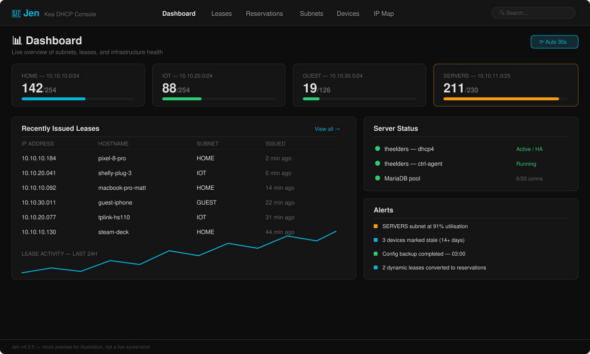

# Jen — Kea DHCP Management Console

A full-featured web-based management interface for [ISC Kea DHCP Server](https://www.isc.org/kea/), built with Python and Flask. Jen provides a comprehensive UI for managing DHCP leases, reservations, subnets, and infrastructure — accessible from any browser including mobile and iPad.

[](https://github.com/ltkojak/jen-kea/releases)
[](https://python.org)
[](https://flask.palletsprojects.com)
[](LICENSE)

---


*Mock preview for illustration — not a live screenshot.*

---

## Features

### Dashboard
- Live subnet utilisation cards with dynamic/reserved breakdown and gateway/DNS display
- Recently issued leases with time filter
- Server status and HA state
- Alert summary feed
- Auto-refresh with configurable interval
- Customisable widget layout

### Lease & Reservation Management
- Browse active leases with subnet, search, and time filters
- Manual lease release, stale lease cleanup
- One-click convert dynamic lease to reservation
- Full reservation add/edit/delete with notes
- Bulk CSV import and export
- Duplicate detection (IP and MAC)

### Subnet Management
- Edit pool ranges, lease times, gateway, and DNS directly from the UI
- Changes applied via SSH to Kea with config validation before restart
- Auto-backup before every change with rollback on failure
- Gateway and DNS visible on subnet cards

### IPv6 (DHCPv6)
- Off by default; enable per-deployment from Settings → Infrastructure
- Leases, Devices, Reservations, Subnets, Dashboard, and global Search
  all support an IPv4/IPv6 view
- Add, edit, and delete IPv6 reservations (address, delegated prefix,
  or both) and subnet pools/timers from the UI, with the same
  validate-before-apply safety as IPv4 subnet edits
- Author a starting `kea-dhcp4.conf`/`kea-dhcp6.conf` from Jen when one
  doesn't exist yet — pulls interfaces and database settings from the
  other protocol's config when it's already running, so adding IPv6 to
  an existing IPv4 deployment doesn't mean re-entering everything by hand
- `/metrics` gains dedicated `jen_subnet6_*`/`jen_kea6_up` series

### Device Management
- Device inventory with type detection (OUI fingerprinting)
- Filter by type, subnet, search, stale status
- Custom device icons

### Notifications
- Multi-channel alerts: Pushover, Telegram, Slack, ntfy, Discord, Email, Generic Webhook
- Alert types: Kea up/down, new lease, new device, rogue device, daily summary, subnet utilisation threshold
- Per-channel configuration and test

### Security & Access Control
- Three-tier role system: SuperAdmin / Admin / Viewer
- Subnet-level access control per user
- MFA (TOTP + WebAuthn/passkey)
- Trusted device management
- Login rate limiting
- Session timeout (global default with per-user override)
- Full audit log with configurable retention
- HTTPS via SSL certificate upload

### Database & Backup
- Scheduled backups (Jen DB + Kea reservations)
- Manual backup and restore
- Database export/import

### Plugin System
- Install optional add-ins from Settings → Plugins
- Plugin registry fetched live from GitHub
- Enable/disable/update/uninstall from the UI
- Available plugins: Network Discovery, IPAM Lite

---

## Requirements

- Ubuntu 22.04 or 24.04 (bare metal or Docker)
- Python 3.10+
- ISC Kea DHCP 3.0+ with MySQL backend and Control Agent
- MySQL or MariaDB

---

## Installation

### Guided Installer (recommended)

```bash
tar xzf jen-v5.1.4.tar.gz
cd jen
sudo ./install.sh
```

The installer checks requirements, walks through configuration interactively, tests Kea API and database connections, and starts the service.

### Docker (external MySQL)

```bash
cd jen
cp jen.config.example jen.config
nano jen.config
docker compose up -d
```

### Docker (bundled MySQL)

```bash
cd jen
cp jen.config.example jen.config
nano jen.config
cp .env.example .env
nano .env
docker compose -f docker-compose.mysql.yml up -d
```

---

## First Login

Open `http://your-server:5050`

| Username | Password |
|----------|----------|
| admin | admin |

Change your password immediately after first login.

---

## Upgrading

```bash
tar xzf jen-v5.1.4.tar.gz
cd jen
sudo ./install.sh
```

The installer detects the existing version and upgrades in place. Config, SSL certificates, SSH keys, and user accounts are always preserved.

---

## Plugins

Jen supports optional plugins installable from **Settings → Plugins**.

| Plugin | Description | Repo |
|--------|-------------|------|
| Network Discovery | Scan subnets for devices not in Kea. Detects rogue devices, fires alerts. Requires nmap. | [jen-plugin-network-discovery](https://github.com/ltkojak/jen-plugin-network-discovery) |
| IPAM Lite | Full IP address space view. See every IP — available, dynamic, reserved, or static. Add labels, owners, notes. CSV export. | [jen-plugin-ipam](https://github.com/ltkojak/jen-plugin-ipam) |

---

## Background

Jen was built by Matthew Thibodeau, an IT engineer with over two decades of experience. After deploying ISC Kea DHCP in his home lab, he found that ISC Stork fell short of what he needed — so he built Jen to fill that gap. It has grown from a homelab tool into a full-featured open-source DHCP management console.

---

## License

GPL v3 — Copyright 2026 Matthew Thibodeau
