<div align="center">
  
</div>

# Jen — Kea DHCP Management Console

**Jen manages [ISC Kea DHCP Server](https://www.isc.org/kea/) from any browser — a self-hosted console built for a homelab to a small business, one to a handful of Kea servers.** Edit subnets and reservations, see why a client got the address it got, and recover from a bad config change, without touching a terminal on the Kea box itself. ([What Jen is, in detail →](docs/about.md))

[](https://github.com/ltkojak/jen-kea/releases/latest)
[](https://github.com/ltkojak/jen-kea/releases)
[](https://github.com/ltkojak/jen-kea/actions/workflows/kea-compat.yml)
[](https://python.org)
[](https://flask.palletsprojects.com)
[](LICENSE)

---

## Get started

### Try it in ten minutes

Docker, bundled database, nothing else to stand up first:

```bash
git clone https://github.com/ltkojak/jen-kea.git && cd jen-kea
cp .env.example .env   # set MYSQL_ROOT_PASSWORD, JEN_MYSQL_PASSWORD, JEN_INITIAL_ADMIN_PASSWORD — leave the Kea section blank to connect it later from /setup
docker compose -f docker-compose.mysql.yml up -d
```

Open `http://localhost:5050`, log in as `admin`, and `/setup` walks you through connecting a Kea server — or skip it and connect one later from Settings.

### Install natively

For a bare-metal or VM install, onto an existing Ubuntu 22.04/24.04 box:

```bash
tar xzf jen-vX.Y.Z.tar.gz   # the latest release, see the badge above
cd jen
sudo ./install.sh
```

The installer asks for exactly three things — Jen's own database, the ports, and an admin password — then starts the service. Kea connects afterward, live, through `/setup`. For a repeatable install, skip the prompts entirely with `sudo ./install.sh --answers <file> --unattended` (see [`docs/installation.md`](docs/installation.md)).

---

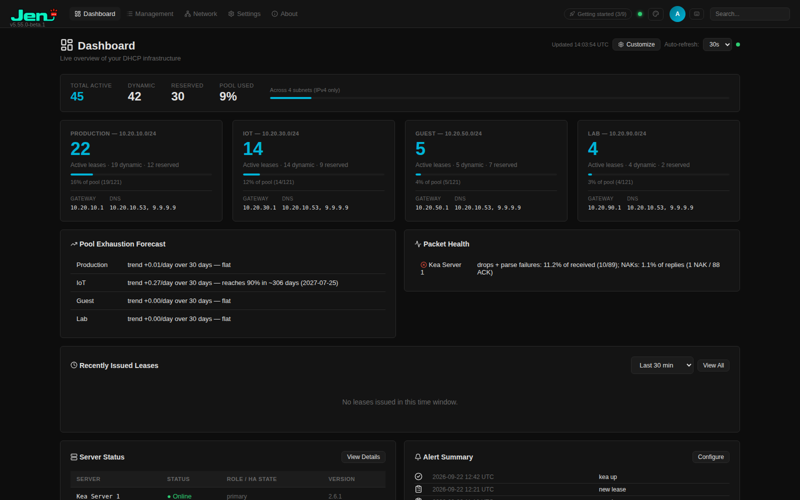

<details>
<summary>More screenshots</summary>

**Leases**
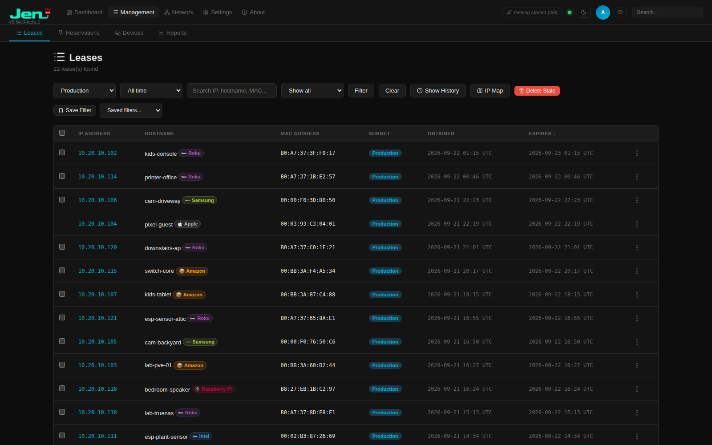

**Reservations**
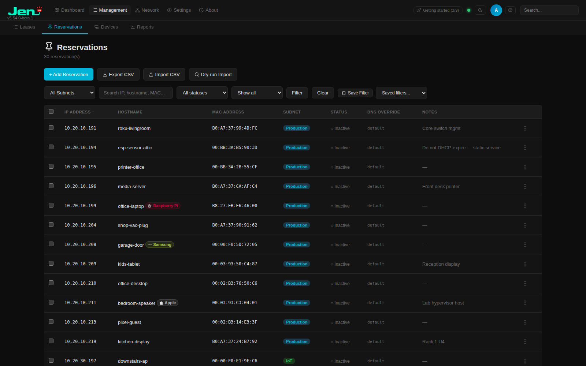

**Subnets & scope options**
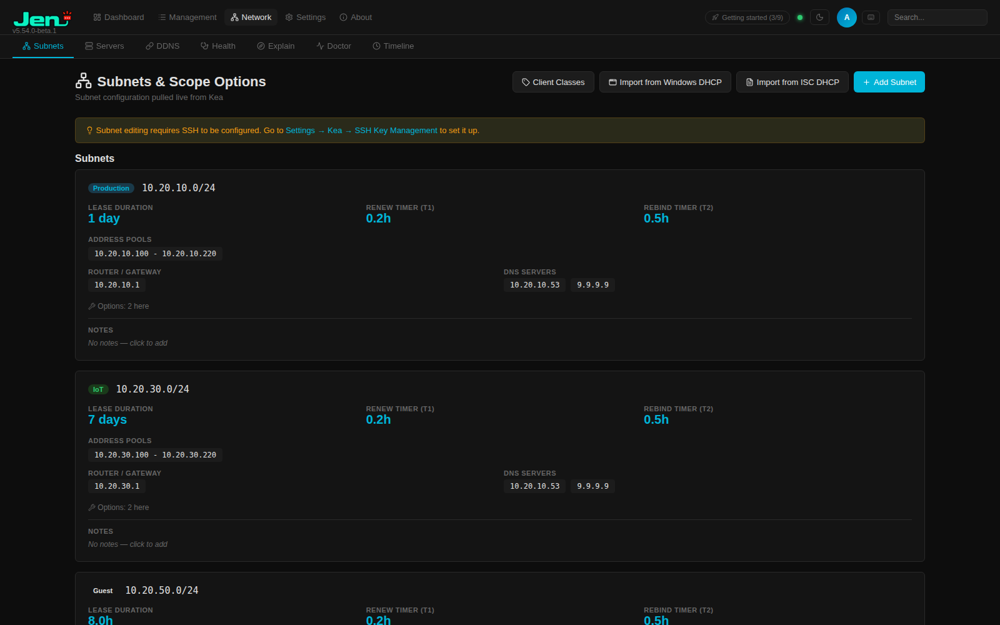

**Reports**
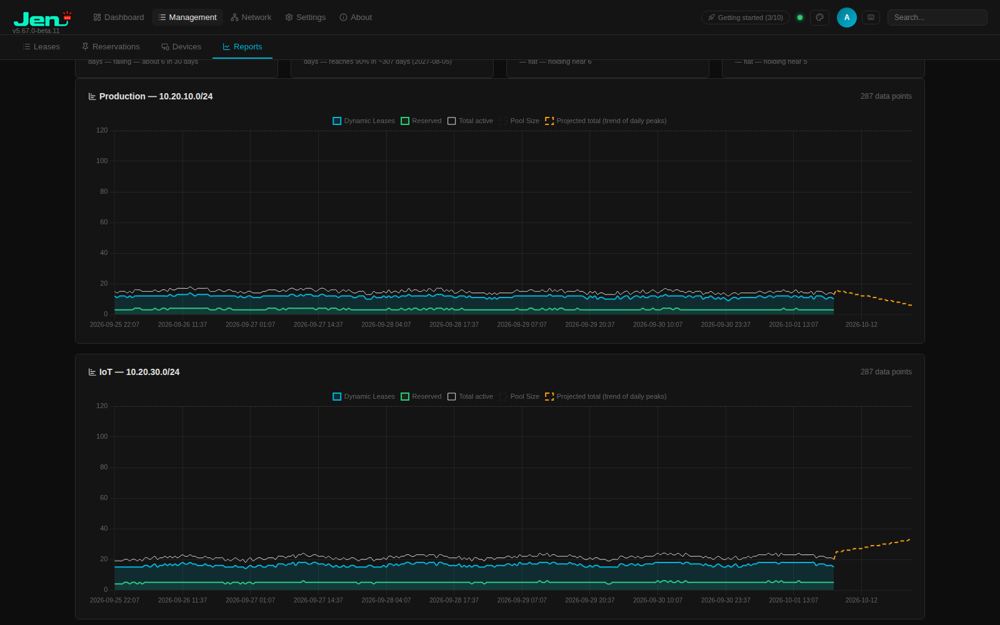

**The first hour — `/setup`, a six-step guided wizard a fresh install lands on once**
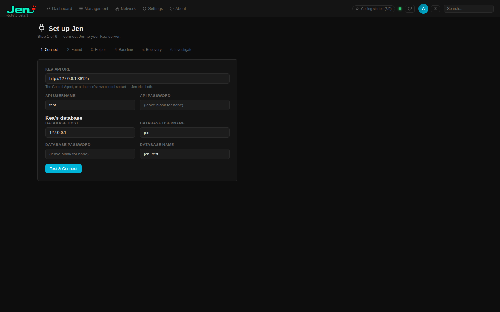
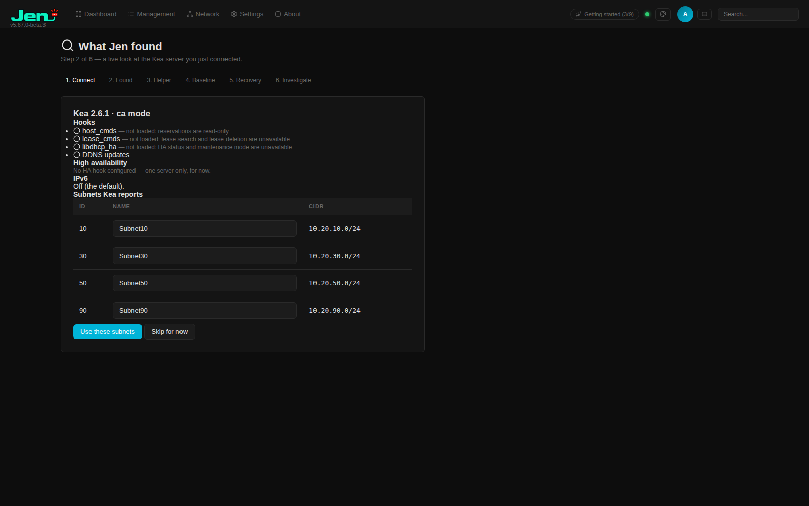
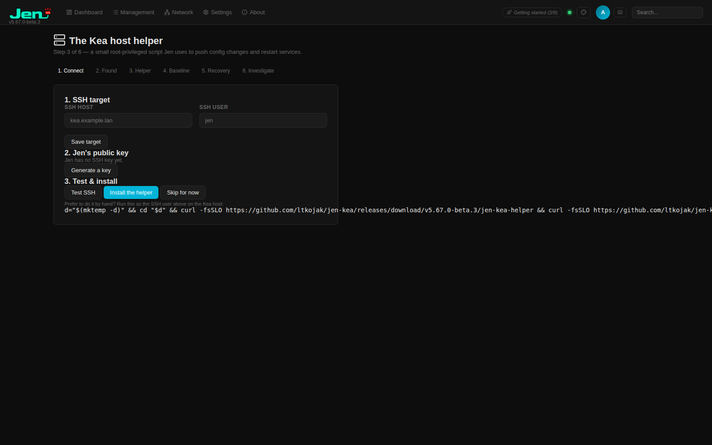
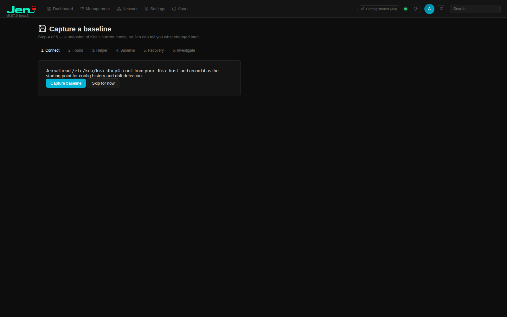
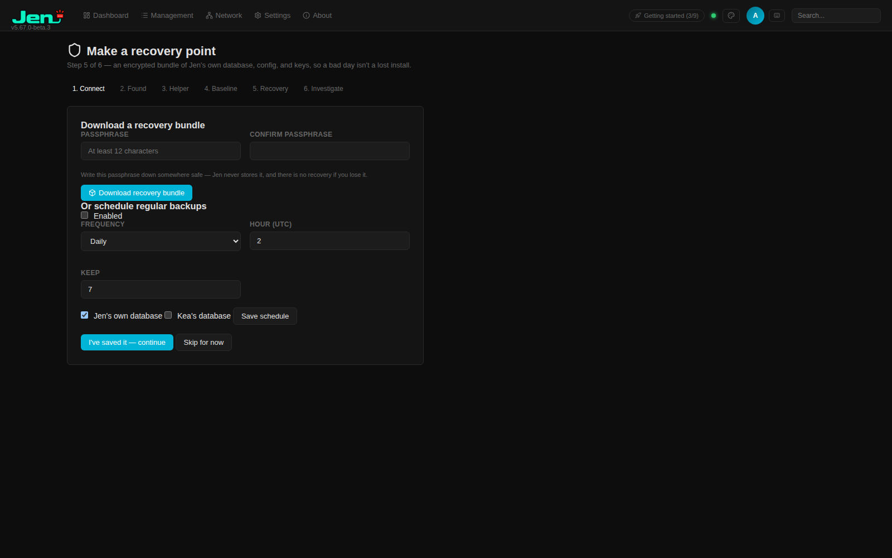
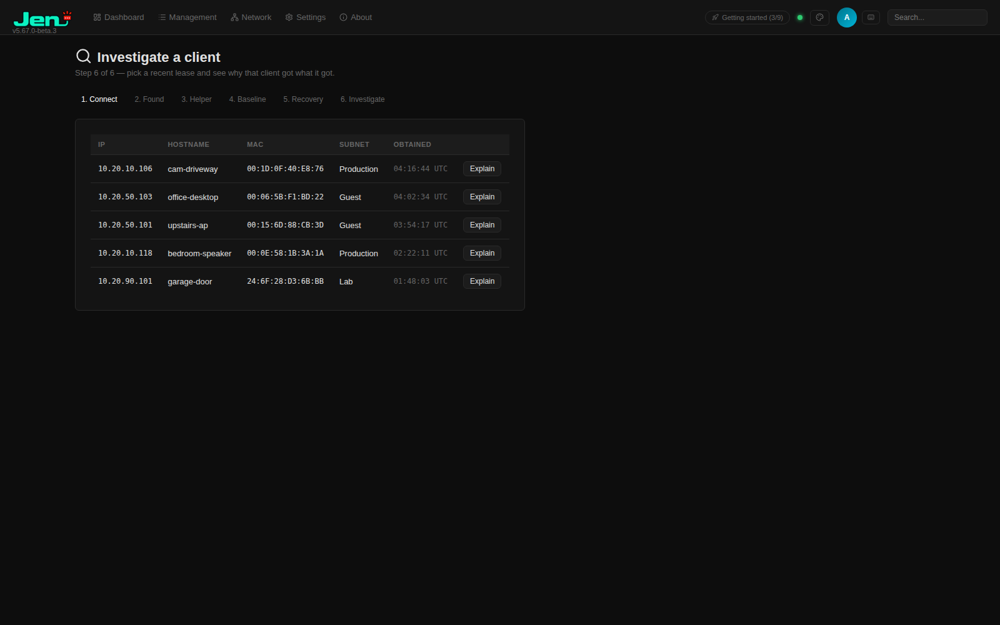

**On a phone**

<p align="center">
  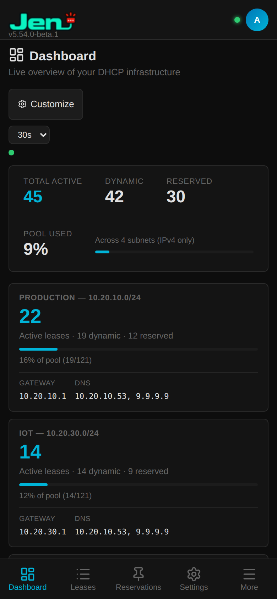
  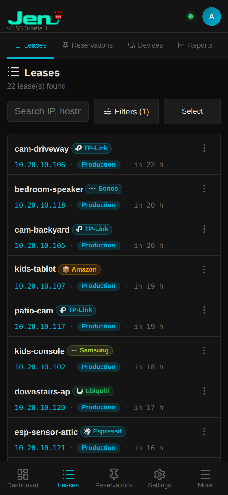
  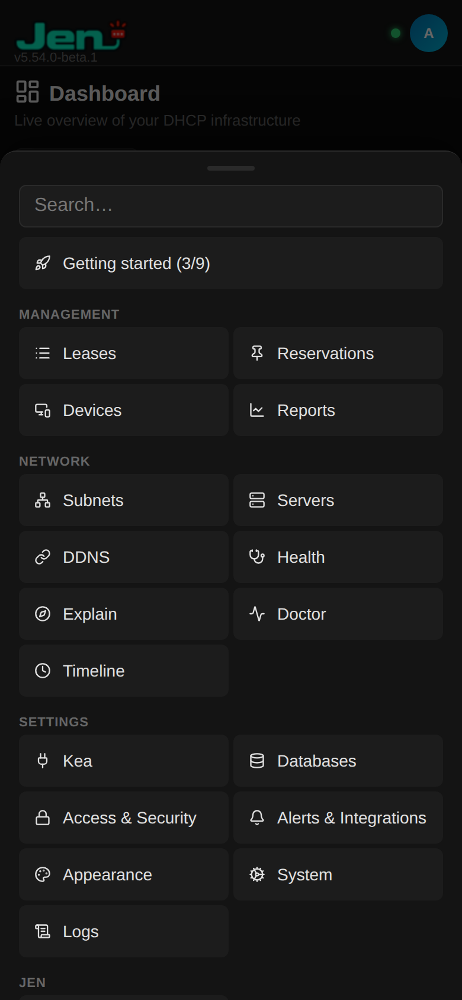
</p>

These screenshots are generated in CI from a fictional dataset (`tests/e2e/demo_data.py`), so they never show a real network.

</details>

---

## What Jen does

Full detail, with the version each capability shipped in, is in [`docs/features.md`](docs/features.md). This is the quick reference — what each area does, and what it needs beyond the base install.

| Area | What Jen does | What it needs |
|---|---|---|
| Dashboard & monitoring | Live subnet utilization, recent leases, HA state, alerts, 7 built-in themes | — |
| Leases & reservations | Browse/release/export leases; convert a dynamic lease to a reservation; bulk CSV import | `host_cmds` hook for write operations |
| Subnets, pools & options | Edit pools, lease times, gateway/DNS, shared networks, DHCP options at every level, client classes, config history with restore | SSH + the [Kea host helper](#glossary) |
| Import | From a Windows DHCP export or an ISC `dhcpd.conf`, reviewed and previewed before applying | SSH + the Kea host helper |
| Diagnose | Investigate / Explain / Trace / Timeline for one client; Configuration Doctor; DNS↔DHCP reconcile | Trace needs the Kea host helper; fuller answers with `lease_cmds`/`host_cmds` |
| Plan | Pool exhaustion forecast; Kea 3.2 readiness check | — |
| High availability | Live HA state, a per-subnet lease comparison across the pair, and a guided maintenance stepper | the `libdhcp_ha` hook |
| Packet health | Drops, parse failures and NAKs from Kea's own counters, with Kea 3.2's richer drop reasons | Kea 3.2+ for drop-reason detail |
| Recovery | One encrypted bundle (Jen's database, config, keys, content); `install.sh --restore` puts it back | — |
| IPv6 (DHCPv6) | Leases, Devices, Reservations, Subnets, Dashboard and Search in a v6 view; author a starting `kea-dhcp6.conf` | Off by default; Kea built with DHCPv6 |
| Device management | Inventory with OUI fingerprinting, filter by type/subnet, custom icons | — |
| Notifications | 7 channels (Pushover, Telegram, Slack, ntfy, Discord, Email, Webhook), 6 alert types | — |
| Access control | 3 roles, per-subnet scope, TOTP/passkey MFA, SSO via OpenID Connect, full audit log | — |
| Plugins | 7 bundled add-ins — network discovery, IPAM, host watchdog, DNS sync, switch-port locator, Wake-on-LAN, presence | Each opt-in; some need an extra host tool (`nmap`, `snmpbulkwalk`) |

---

## How Jen talks to Kea

Jen is **agentless** — nothing runs on your Kea servers. One Flask
process reaches out to each Kea box over three channels:

| Channel | Used for | Direction |
|---------|----------|-----------|
| **Kea command HTTP API** | Live status, config reads, HA state, lease statistics — via the Control Agent (`ca` mode) or straight to each daemon's own control socket (`direct` mode, for Kea 3.2+ which removed the Control Agent) | Jen → Kea, read-mostly |
| **Kea database (MySQL/MariaDB)** | Lease and reservation data, written only through the same tables/commands Kea's own tooling uses (mostly the `host_cmds` hook, never raw schema changes) | Jen ↔ Kea DB |
| **SSH** | Applying subnet/pool edits to `kea-dhcp*.conf`, validating the new config, restarting the service, reading logs | Jen → Kea host |

Every config change is validated against Kea before it is written,
backed up on the host, and recorded in Jen's config history (Servers →
Config history) so any change can be restored. A multi-server change
is pre-flighted everywhere before the first write and reverted if a
later server refuses it; a service that won't restart is reported, not
silently retried. Jen never modifies Kea's database schema — only its
data.

The tradeoff: this is deliberately built for a homelab-to-small-business
operator running a handful of servers, not a fleet. See
[`docs/ARCHITECTURE.md`](docs/ARCHITECTURE.md) for the full design and
threat model.

---

## Compatibility

Generated from Jen's own CI, not hand-maintained — if a version isn't
tested here, it isn't claimed.

| | Tested |
|---|---|
| **Kea** | 3.0.3 (LTS) and 3.2.0 (stable) — real `kea-dhcp4` images, weekly; 3.3.1 (dev, informational only) |
| **Operating system** | Ubuntu 22.04, Ubuntu 24.04 |
| **Database** | MariaDB 10.11, MariaDB 11.4, MySQL 8.0 |
| **Python** | 3.10, 3.12 |

Kea versions below 3.0 are not supported. Kea 3.2+ removed the Control
Agent — Jen talks to each daemon's own control socket instead (Settings
→ Kea → "Set up direct socket"), set up automatically from v5.29.0.

---

## First Login

Open `http://your-server:5050` and sign in as **`admin`**.

- If you set an admin password during install (`JEN_INITIAL_ADMIN_PASSWORD`,
  or the bare-metal wizard), use that.
- Otherwise Jen generates one at first boot and writes it to
  `/var/lib/jen/initial-admin-password` (also in the log / Docker logs).
  Jen requires you to change it immediately, then deletes the file.

From v5.67.0, a fresh install with Kea not yet connected lands you on
**`/setup`** after your first login: a six-step guided first hour that
connects Kea live, shows what it found, installs the Kea host helper,
captures a config baseline, makes a recovery point, and walks you
through investigating your first client. Every step can be skipped and
picked up again later from the Getting Started checklist.

---

## Upgrading

Download the **[latest stable release](https://github.com/ltkojak/jen-kea/releases/latest)** tarball, then:

```bash
tar xzf jen-vX.Y.Z.tar.gz
cd jen
sudo ./install.sh
```

The installer detects the existing version and upgrades in place. Config, SSL certificates, SSH keys, and user accounts are always preserved.

Settings → Updates offers a one-click in-app update once GitHub is ahead of the installed version. From v5.26.0, every release is signed (`ssh-keygen -Y sign`, ed25519) and the updater verifies that signature — alongside the existing checksum check — before installing anything; a release with no valid signature is refused, not installed with a warning.

From v5.32.0 there are two release channels. Every feature release is published first as a **beta** pre-release (`5.33.0-beta.1`) and becomes **stable** (`5.33.0`) once it has been run for real. Each install follows one channel, chosen on the same Updates page — stable by default; beta if you want to run releases early and report what you find. Switching back never downgrades. See the admin guide's "Release channels".

---

## Plugins

Jen supports optional plugins installable from **Settings → Plugins**.

| Plugin | Description | Repo |
|--------|-------------|------|
| Network Discovery | Scan subnets for devices not in Kea. Detects rogue devices, fires alerts. Requires nmap. | [jen-plugin-network-discovery](https://github.com/ltkojak/jen-plugin-network-discovery) |
| IPAM Lite | Full IP address space view. See every IP — available, dynamic, reserved, or static. Add labels, owners, notes. CSV export. | [jen-plugin-ipam](https://github.com/ltkojak/jen-plugin-ipam) |
| Host Watchdog | Probe chosen hosts (ICMP or TCP) on a schedule; alert when one stops answering and again when it returns. Requires `ping` on the Jen host. | [jen-plugin-watchdog](https://github.com/ltkojak/jen-plugin-watchdog) |
| Local DNS Sync | Push DHCP names into Pi-hole v6 or AdGuard Home so `nas.lan` resolves without Kea DDNS. A mandatory preview; only records it created are ever touched. | [jen-plugin-dns-sync](https://github.com/ltkojak/jen-plugin-dns-sync) |
| Switch Port Locator | Which switch port is this MAC on? Polls managed switches over SNMP. Requires `snmpbulkwalk` (package `snmp`). | [jen-plugin-switchport](https://github.com/ltkojak/jen-plugin-switchport) |
| Wake & Actions | Wake-on-LAN from a lease, reservation or device row, plus a favourites list; rate-limited and audited. | [jen-plugin-wol](https://github.com/ltkojak/jen-plugin-wol) |
| Presence | Publish tracked devices' online/offline state to Home Assistant, MQTT or any HTTP endpoint. | [jen-plugin-presence](https://github.com/ltkojak/jen-plugin-presence) |

---

## Jen compared to ISC Stork

[ISC Stork](https://www.isc.org/stork/) is the official monitoring
dashboard for Kea and BIND. It and Jen solve overlapping problems from
opposite directions; every claim below is checked against ISC's own
Stork documentation, not assumed.

| | **Jen** | **ISC Stork** |
|---|---|---|
| Architecture | Agentless — one process connects out to each server | An agent (`stork-agent`) installed on every managed server |
| Primary focus | Day-to-day **management**: edit subnets/pools/reservations, manage leases and devices | **Monitoring** and metrics; config editing (subnets, reservations, options) added more recently, with some capabilities still unavailable |
| Config changes | Validated SSH push to `kea-dhcp*.conf`, host-side backup, pre-flight across servers, config-history restore | A Kea config-management API (hooks or direct JSON) |
| Scale target | Homelab to small business, a handful of servers | Built to centralize monitoring across a fleet |
| Access control | Three roles + per-subnet scoping, local accounts, TOTP/passkey MFA or OpenID Connect SSO | Three roles (`super-admin`/`admin`/`read-only`), local accounts or LDAP |
| Database | MySQL / MariaDB | PostgreSQL |
| Extras | Device inventory & OUI fingerprinting, multi-channel alerting, plugin system, custom branding | Grafana/Prometheus export; BIND 9 monitoring (early stage, read-only) |
| License | GPL v3 | MPL 2.0 |

If you run a fleet, want Prometheus/Grafana dashboards, or also manage
BIND, use Stork. If you want a single-process console to *operate* a
small number of Kea servers from any browser, that's what Jen is for.
Where a fleet console shows what happened, Jen also answers why this client
got this address, what is about to run out, what changed, and what to do
before Kea 3.2.

---

## Glossary

Terms the docs use one way, everywhere:

- **Kea host helper** (`jen-kea-helper`) — a small, fixed-function
  script installed on each Kea server (one `sudo` grant, one binary)
  that performs config reads/writes, validation, and restarts on Jen's
  behalf. Jen never runs arbitrary commands on a Kea host.
- **Recovery bundle** — a single encrypted file with Jen's database,
  config, keys and content; restorable with `install.sh --restore`.
  Not a Kea backup — Kea's own data lives in its own database.
- **Change set** — the unit Jen uses to push one logical edit to every
  SSH-configured Kea server: every target validated before the first
  write, writes in sequence, already-committed targets reverted if a
  later one fails.
- **Subnet map** — the subnets Jen knows about and their display
  names, configured in Jen and kept separate from Kea's own subnet
  config, which Jen reads but does not define.

See [`docs/about.md`](docs/about.md) for the full picture — what Jen
is, is not, and requires — written for someone deciding whether to try
it, not for an existing user.

---

## Background

Jen was built by Matthew Thibodeau, an IT engineer with over two decades of experience. After deploying ISC Kea DHCP in his home lab, he found that ISC Stork fell short of what he needed — so he built Jen to fill that gap. It has grown from a homelab tool into a full-featured open-source DHCP management console.

---

## License

GPL v3 — Copyright 2026 Matthew Thibodeau
